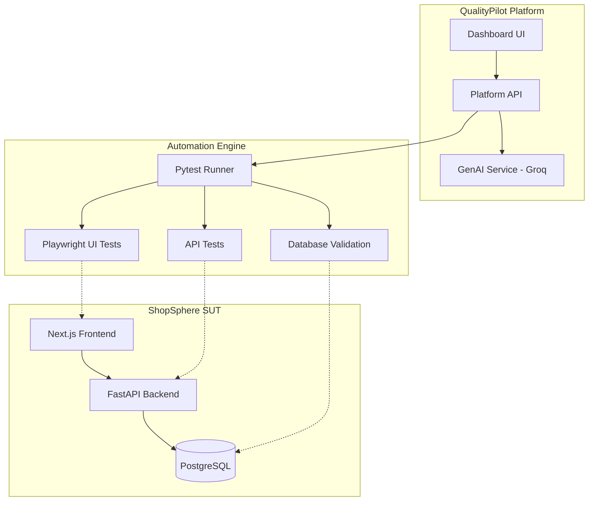

# Architecture

## High-Level Architecture

The system consists of three main boundaries: the System Under Test (ShopSphere), the Testing Framework (Automation), and the Quality Platform (QualityPilot).

## Current Implementation (Phase 1)
Currently, only the `Backend` and `DB` of the ShopSphere SUT are implemented. The backend exposes a REST API via FastAPI and connects to PostgreSQL using SQLAlchemy.
