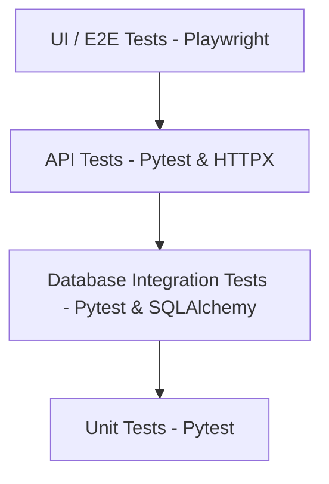

# Testing Strategy

*(To be updated in Phases 3-6)*

## Testing Pyramid

## Core Principles
1. **Deterministic Validation:** LLMs never decide if a test passes or fails. Code assertions (status codes, JSON schemas, DB state, Locator visibility) act as the source of truth.
2. **Push Down the Pyramid:** If an issue can be caught at the API or DB level, write the test there instead of a slow UI test.
3. **Data Independence:** Tests should set up and tear down their own data state to prevent cross-test contamination.
