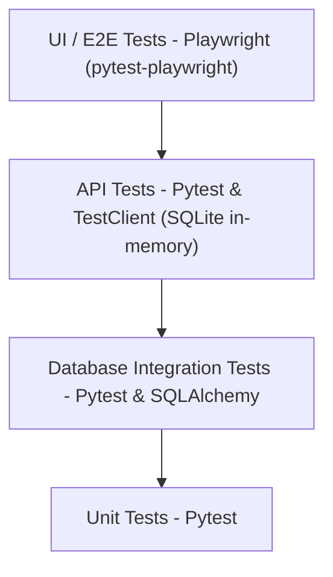

# Testing Strategy

## Testing Pyramid



## Core Principles
1. **Deterministic Validation:** LLMs never decide if a test passes or fails. Code assertions (status codes, JSON schemas, DB state, Locator visibility) act as the source of truth.
2. **Push Down the Pyramid:** If an issue can be caught at the API or DB level, write the test there instead of a slow UI test.
3. **Data Independence:** Tests should set up and tear down their own data state to prevent cross-test contamination.

## Test Layers

### Layer 1: Unit Tests (`tests/unit/`)
- **Tool:** Pytest
- **Scope:** Individual functions, schemas, security utilities
- **Database:** None (pure logic)
- **Speed:** ~0.5s total

### Layer 2: API Integration Tests (`tests/api/`)
- **Tool:** Pytest + FastAPI TestClient
- **Scope:** Full request → response cycle through all middleware and dependencies
- **Database:** SQLite in-memory (via `app.dependency_overrides`)
- **Speed:** ~7s total (23 tests)

### Layer 3: E2E UI Tests (`tests/e2e/`)
- **Tool:** Pytest + Playwright (Chromium headless)
- **Scope:** Full user flows in a real browser against live services
- **Database:** PostgreSQL (real, shared with running backend)
- **Speed:** ~30-60s total (depends on network and rendering)
- **Prerequisites:** Backend + Frontend + PostgreSQL must be running

## Running Tests

```bash
# Unit + API tests (default, no external services needed)
cd backend && pytest

# E2E tests only (requires live services)
cd backend && pytest tests/e2e -v --headed  # with browser visible
cd backend && pytest tests/e2e -v           # headless (CI mode)
```

## Element Selection Strategy (E2E)
All UI elements targeted by E2E tests use `data-testid` attributes. This ensures:
- Resilience to CSS/Tailwind class changes
- Independence from text content (localization-safe)
- Explicit contract between frontend and test code
