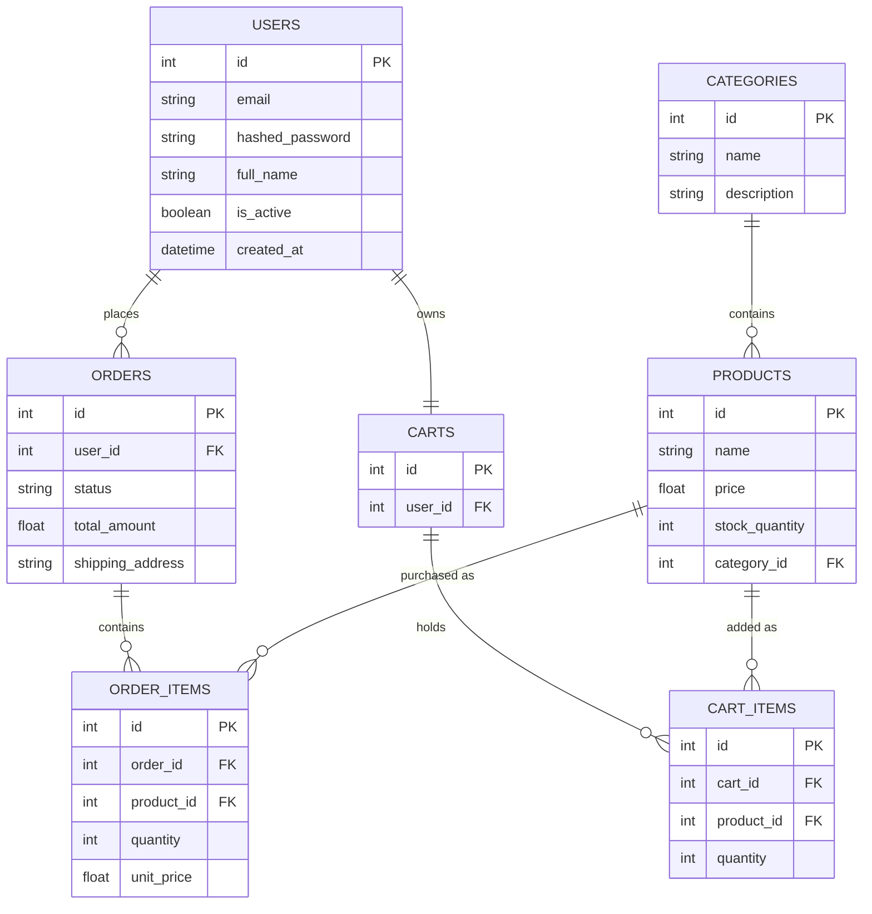

# Database Design

## ER Diagram (ShopSphere)

## Validation Strategy
When automating tests, database validations will interact with these tables. For example, testing `POST /api/v1/orders` will verify that records are successfully inserted into both `ORDERS` and `ORDER_ITEMS`, and that the `total_amount` matches the sum of the `CART_ITEMS` prior to checkout.
